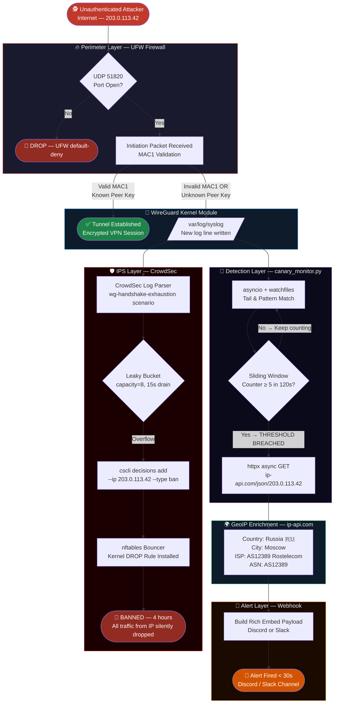

# 🛡️ Cloud VPN Gateway with Canary Breach Alerts

<div align="center">


[](https://github.com/shanmkuu/Cloud-VPN-Gateway-with-Canary-Breach-Alerts/actions/workflows/security-scan.yml)

**A production-grade, CIS/NIST-aligned WireGuard VPN gateway with an async Python canary monitor that detects breach attempts and fires real-time GeoIP-enriched alerts to Discord/Slack.**

</div>

---

## 🚨 The Problem

Modern VPN gateways face sophisticated threats that traditional firewalls miss:

| Threat | Impact | Traditional Defence |
|--------|--------|-------------------|
| WireGuard MAC1 exhaustion | Crypto-stack CPU DoS | None (no session state) |
| Handshake flood | Gateway unresponsive | Rate-limit at ISP only |
| Silent reconnaissance | Peer enumeration | No detection |
| Late-night intrusions | Hours before discovery | Email alerts next morning |

**Security operations teams are blind** to WireGuard-layer attacks because existing SIEM solutions don't parse WireGuard kernel messages, and by the time a human investigates logs, the attacker has already mapped the infrastructure.

---

## ✅ The Solution — This Project

A **three-layer defence architecture** that detects, blocks, and alerts in under 30 seconds:

1. **Hardened Kernel** — sysctl anti-spoofing, SYN cookies, ASLR, UFW default-deny
2. **CrowdSec IPS** — custom scenario for WireGuard handshake exhaustion with auto-ban
3. **Python Canary Monitor** — async log watcher that fires GeoIP-enriched rich embed alerts to Discord/Slack before humans would ever read the logs

---

## 🗺️ Packet Journey — Threat to Block



---

## 📁 Project Structure

```
Cloud-VPN-Gateway-with-Canary-Breach-Alerts/
│
├── src/
│   └── canary_monitor.py       # Async canary monitor (asyncio + watchfiles)
│
├── scripts/
│   └── harden.sh               # Kernel + UFW + SSH hardening script
│
├── configs/
│   ├── wg0.conf                # WireGuard server config template
│   ├── .env.example            # Environment variable template
│   └── crowdsec/
│       └── wg-handshake-exhaustion.yaml  # Custom CrowdSec scenario (2 variants)
│
├── .github/
│   └── workflows/
│       └── security-scan.yml   # Trivy + Bandit + pip-audit + ShellCheck CI
│
├── setup.sh                    # One-click installer (Ubuntu 24.04)
├── requirements.txt            # Python dependencies
├── RESOURCES.md                # NIST / CIS benchmark mapping
├── .gitignore                  # Excludes keys, .env, scan artifacts
└── .trivy.yaml                 # Trivy scanner configuration
```

---

## ⚡ Quick Start (One-Click Install)

```bash
# On a fresh Ubuntu 24.04 LTS server — run as root
curl -fsSL https://raw.githubusercontent.com/shanmkuu/Cloud-VPN-Gateway-with-Canary-Breach-Alerts/main/setup.sh \
  | sudo bash

# Or clone and run locally
git clone https://github.com/shanmkuu/Cloud-VPN-Gateway-with-Canary-Breach-Alerts.git
cd Cloud-VPN-Gateway-with-Canary-Breach-Alerts
sudo bash setup.sh [WG_PORT] [SSH_PORT]
# Defaults: WG_PORT=51820, SSH_PORT=2222
```

### Post-Install: Enable Alerts (2 minutes)

```bash
# 1. Set your Discord/Slack webhook URL
sudo nano /opt/wg-canary/.env
# → Set WEBHOOK_URL=https://discord.com/api/webhooks/...

# 2. Start the canary monitor
sudo systemctl start wg-canary
sudo systemctl status wg-canary    # Should show "active (running)"

# 3. Watch live alerts
sudo journalctl -fu wg-canary
```

---

## 🔬 Component Deep-Dive

### 1. Kernel Hardening (`scripts/harden.sh`)

| sysctl Key | Value | Threat Mitigated |
|-----------|-------|-----------------|
| `net.ipv4.conf.all.rp_filter` | `1` | IP Spoofing / Source Routing |
| `net.ipv4.conf.all.accept_redirects` | `0` | ICMP Redirect MitM |
| `net.ipv4.tcp_syncookies` | `1` | SYN Flood DoS |
| `kernel.randomize_va_space` | `2` | Buffer Overflow / ROP |
| `kernel.dmesg_restrict` | `1` | Kernel Pointer Leak |

UFW is configured with `ufw default deny incoming` + `ufw default deny forward`, opening **only** `UDP/51820` (WireGuard) and your chosen SSH port.

### 2. Python Canary Monitor (`src/canary_monitor.py`)

```
Architecture:
  watchfiles.awatch() ──▶ asyncio.Queue ──▶ FailureTracker (sliding window)
                                                     │
                          httpx.AsyncClient ◀─── threshold breach?
                                   │
                          ip-api.com GeoIP ──▶ Discord/Slack Rich Embed
```

- **Zero blocking I/O** — pure async throughout (`async def`, `await`, `asyncio.gather`)
- **Sliding window** — `deque`-backed per-IP timestamp tracking (O(1) expire)
- **Alert cooldown** — won't re-alert same IP within the window (deduplication)
- **Graceful fallback** — polling mode if `watchfiles` inotify unavailable
- **Dry-run mode** — `DRY_RUN=1` prints payloads without sending (perfect for testing)

### 3. CrowdSec IPS (`configs/crowdsec/wg-handshake-exhaustion.yaml`)

Two complementary scenarios:

| Scenario | Algorithm | Trigger | Ban Duration |
|----------|-----------|---------|-------------|
| `wg-handshake-exhaustion` | Leaky bucket | 8 events, drain 15s | 4 hours |
| `wg-handshake-burst` | Trigger | 20 events in ~20s | 48 hours |

---

## 🔒 Security Design Decisions

| Decision | Rationale |
|----------|-----------|
| WireGuard over OpenVPN | 4x faster handshake, smaller attack surface, kernel-native |
| CrowdSec over Fail2Ban | Collaborative threat intel, CTI-backed blocklists, modern bouncer API |
| Non-standard SSH port | Eliminates ~99% of automated SSH scanner noise |
| Pre-shared keys (PSK) | Adds post-quantum resistance layer to WireGuard key exchange |
| `watchfiles` over `tail -f` | inotify-backed, async-native, zero CPU at idle |
| `httpx` over `aiohttp` | HTTP/1.1+2 support, sync/async unified API, better timeout handling |

---

## ⚠️ Security Notes

> **Private Keys**: `wg0.conf` contains your WireGuard private key. It is excluded from git via `.gitignore`. **Never commit real key values.**

> **Webhook URL**: Treat your webhook URL as a secret. Anyone with it can post to your channel. Store it only in `/opt/wg-canary/.env` (mode 600).

> **ip-api.com**: Free tier allows 45 requests/minute. For high-volume production use, consider [MaxMind GeoLite2](https://dev.maxmind.com/geoip/geolite2-free-geolocation-data/) (local DB, no rate limit).

---

## 🚀 CI/CD Security Pipeline

The `.github/workflows/security-scan.yml` pipeline runs on every push and weekly:

```
┌──────────────────────────────────────────────────────────┐
│                   Security Gate CI                       │
├──────────────┬──────────────┬──────────────┬────────────┤
│ Bandit SAST  │  pip-audit   │    Trivy     │ ShellCheck │
│ (Python AST) │ (dep vulns)  │ (FS+secrets) │ (scripts)  │
│              │              │              │            │
│ → SARIF →    │ → JSON →     │ → SARIF →    │ → stdout   │
│ GitHub Sec   │ Artifact     │ GitHub Sec   │            │
└──────────────┴──────────────┴──────────────┴────────────┘
                         │
               Security Summary Gate
             (FAILS if secrets found)
```

---

## 📋 Standards Compliance

See [RESOURCES.md](RESOURCES.md) for full benchmark mapping.

| Standard | Controls Addressed |
|----------|-------------------|
| NIST SP 800-77 Rev.1 | VPN security, key management |
| NIST SP 800-123 | Server hardening baseline |
| NIST SP 800-61 Rev.2 | Incident detection & response |
| CIS Ubuntu 24.04 L2 | 15+ controls (sysctl, UFW, SSH) |
| CIS Controls v8 | Controls 4, 6, 8, 12, 13, 16 |
| OWASP Python Security | Bandit SAST, no hardcoded creds |

---

## 🤝 Contributing

1. Fork the repository
2. Create a feature branch: `git checkout -b feature/your-improvement`
3. Ensure `bandit`, `shellcheck`, and `trivy` pass locally
4. Submit a PR — the security pipeline will automatically validate your changes

---

## 📄 License

MIT License — see [LICENSE](LICENSE) for details.

---

<div align="center">

**Built with 🛡️ by [Emmanuel Leshan](https://shanmkuu.vercel.app)**

*If this project helped you, consider starring ⭐ the repository!*

</div>
